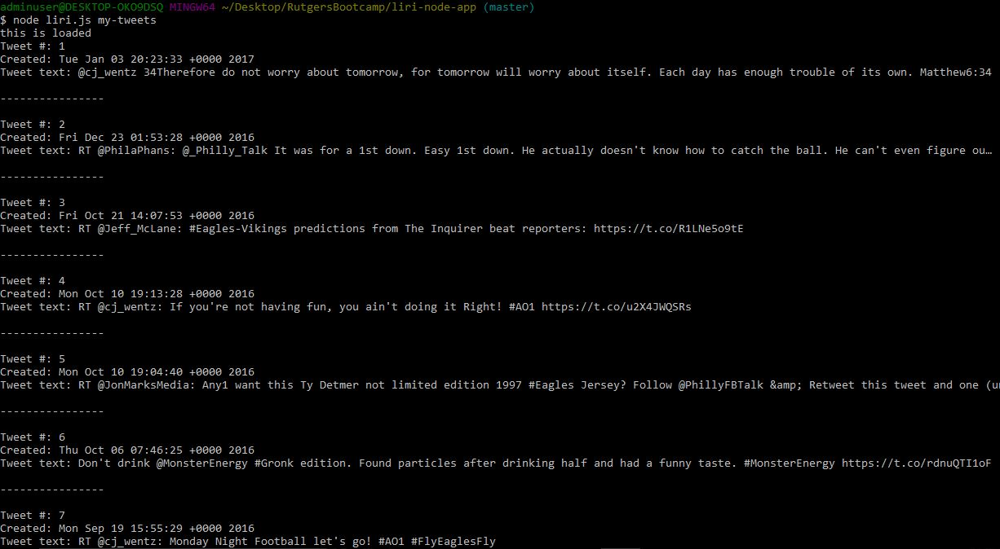

# liri-node-app

#### A Node.js app that uses command line calls to mimic the Appple intelligent personal assistant "SIRI" on the iPhone. 

## Functionality

## Screenshots of App
### The main `/articles` page is where the articles are found. 
