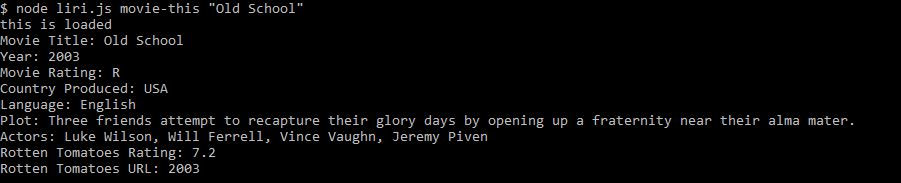
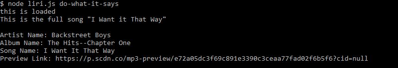

# liri-node-app

#### A Node.js app that uses command line calls to mimic the Appple intelligent personal assistant "SIRI" on the iPhone. 
***
## Functionality

***
## Screenshots of App

### Calling the `node liri.js my-tweets` command, it will load the last 20 tweets/retweets 

### Calling the `node liri.js spotify-this-song '<song name here>'`
#### This displays:
* Artist Name
* Album Name
* Song Name
* Preview Link

### Calling the `node liri.js movie-this '<movie name here>'`
#### This displays:
* Movie Title
* Year 
* Movie Rating
* Country Produced
* Language
* Plot
* Actors
* Rotten Tomatoes Ratings

### Calling the `node liri.js do-what-it-says` will take the command in the `random.txt` and call the command in the data. In this case the `random.txt` contains the command `"spotify-this-song,"I Want it That Way""`

