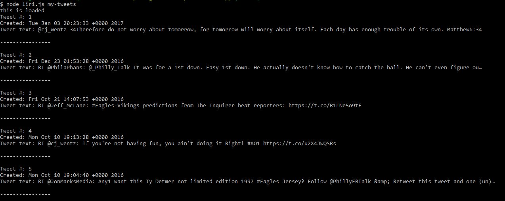

# liri-node-app

#### A Node.js app that uses command line calls to mimic the Appple intelligent personal assistant "SIRI" on the iPhone. 

## Functionality

## Screenshots of App

### Calling the `node liri.js my-tweets` command, it will load the last 20 tweets/retweets 

### Calling the node liri.js spotify-this-song '<song name here>'
### This displays:
* Artist Name
* Album Name
* Song Name
* Preview Link
